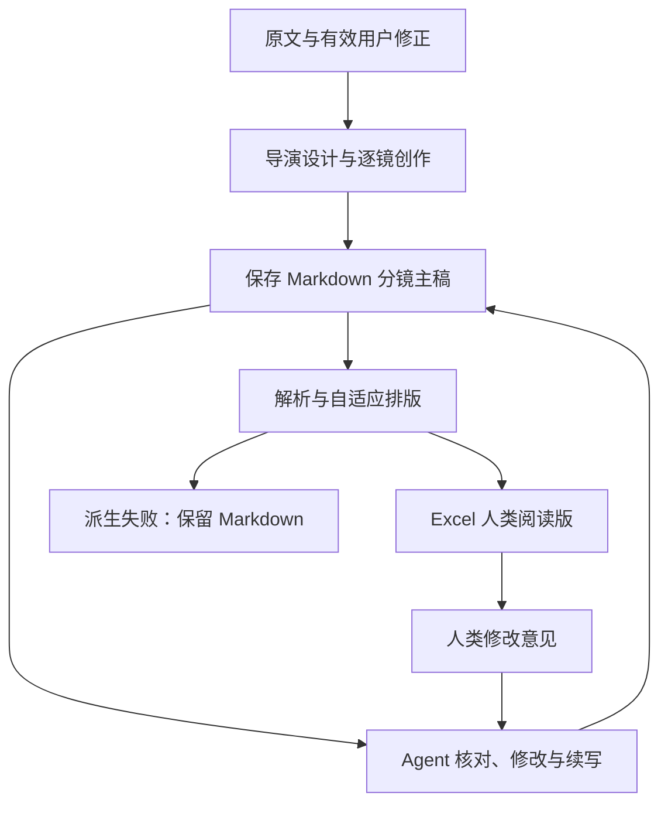

# su-fenjingskill 3.3.1 统一修复计划

目标版本：3.3.1  
基线版本：3.3.0  
基线提交：[`6a7311e16ded7058f28c9f99d47347eca35c6ef0`](https://github.com/suvision6/susu/commit/6a7311e16ded7058f28c9f99d47347eca35c6ef0)  
文档日期：2026-09-05  
文档性质：合并上一轮综合分析与本轮交付流程分析的实施计划。代码修改、3.3.1 安装与发布尚未执行。

**核心决策**

保留 3.3.0 的导演创作核心，以 Markdown 保存完整的分镜主稿，再从已保存的 Markdown 确定性派生 Excel。Markdown 面向 Agent 的定位、核对、修改和续写；Excel 面向人类的阅读与批注。两种格式承担不同阅读任务，共享同一份分镜内容。

原始剧本与有效用户修正继续拥有剧情权威；Markdown 是分镜方案的唯一可编辑主稿，不能覆盖来源事实。Excel 的呈现方式由排版程序决定，剧情、对白、镜头顺序与时长不由排版程序改写。

默认正式交付仍为两份文件：`<项目>-storyboard.md` 与 `<项目>-storyboard.xlsx`。转换过程允许使用内存中的结构化对象，不恢复第三份长期维护的 JSON 主稿。

**一、两轮分析合并后的修复范围**

| 上轮发现／本轮要求 | 3.3.1 的处理决策 | 完成的含义 |
| --- | --- | --- |
| 创作核心已经明显改善 | 保留切／留／重构自由、观看与发言分离、顺序与重叠估时 | 不恢复镜数配额、长镜上限、默认切或默认留 |
| 原文核对可能只停在引用 | 从有效来源核对 Markdown 中实际安排播放的对白和动作结果 | 原文被引用不等于已经在镜头里演出 |
| 长稿缺少恢复方法 | 长稿在 Markdown 末尾保留简短续记，恢复时回读相关来源 | 不丢完成位置、相关状态、未揭示信息和有效修正 |
| 逐场设计与最终播放顺序未充分区分 | 局部按场设计，按成片顺序组织镜头 | 交叉剪辑、声音桥与现实层切换不会被场次分组破坏 |
| 梗概、双语与声音身份边界不够具体 | 用少量文字补足暂定设计、实际发言语言和来源歧义处理 | 普通可逆选择继续推进，实质剧情歧义提出具体问题 |
| Excel 排版可以阻断两种交付 | 先保存 Markdown；Excel 作为独立派生阶段 | Excel 失败时，已有 Markdown 保持完整、可用 |
| Markdown 与 Excel 面向不同读者 | Markdown 使用分块结构；Excel 保留六列与两张表 | 阅读方式不同，分镜事实一致 |
| 行高、列宽不能写死 | 基于内容、字体与阅读条件计算；超容量使用同镜续行 | 长文本完整展示，不删字、不增加切点、不重复计时 |
| 尚无新版稳定性证明 | 分别做交付回归和少量创作验收 | 不把解析通过、文件生成或规则篇幅减少当成创作稳定性 |

本计划整合了上一轮六类修复建议，将“真实创作评测”放在验收阶段，将文件布局问题归入交付阶段，避免重复增加规则。

**二、历史输出能借鉴什么**

本轮读取了 3.0.0 和 3.1.4 的《厨房告别》实际 Markdown、Excel，以及 3.1.4 的导出与投影实现。

| 历史材料 | 值得保留的做法 | 不直接迁入 3.3.1 的做法 |
| --- | --- | --- |
| 3.0.0 输出 | 场景任务、人物关系与视听策略清楚；第五列相对连贯 | 固定宽度与行高不能作为自适应方案 |
| 3.1.4 输出 | 明确区分人类阅读版和后台表达；两张工作表、标题区、冻结表头有用 | Markdown 包含大量执行字段和计时证明；Excel 依旧可能重复表达 |
| 3.1.4 排版代码 | 自动换行、顶部对齐、打印重复表头、按文本估算高度可作为基础 | 六列宽度固定；分镜行高封顶 180 pt，设计表封顶 160 pt；高度估计宽度与实际列宽还不完全一致 |
| 3.3.0 导出器 | 程序不估时、不重写创作；两份文件来自相同行数据 | 固定像素列宽、540 px 行高报错，以及先 Excel 后 Markdown 的依赖顺序 |

这里尤其要避免把“Agent 阅读版”理解为“后台字段越多越好”。3.1.4 的同一场景 Markdown 明显比人类版更密，但大量观看理由、时间块与状态字段并不是续写所必需。3.3.1 应保留定位和接续所需信息，让创作内容保持连贯。

历史 Excel 已核对实际单元格内容及布局属性。本环境渲染历史文件时缺少可用中文字形，预览中出现中文不可见；这不能当作源文件丢字的证据。因此本轮关于旧版固定尺寸的结论以保存文件与源码为依据，没有声称完成了历史文件在 Mac Excel 中的视觉验收。

来源：[3.0.0 示例](https://github.com/suvision6/susu/tree/6a7311e16ded7058f28c9f99d47347eca35c6ef0/su-fenjingskill-v3.0.0/examples)、[3.1.4 示例](https://github.com/suvision6/susu/tree/6a7311e16ded7058f28c9f99d47347eca35c6ef0/su-fenjingskill-3.1.4/examples)、[3.1.4 导出器](https://github.com/suvision6/susu/blob/6a7311e16ded7058f28c9f99d47347eca35c6ef0/su-fenjingskill-3.1.4/scripts/export_xlsx.py)、[3.3.0 导出器](https://github.com/suvision6/susu/blob/6a7311e16ded7058f28c9f99d47347eca35c6ef0/su-fenjingskill-v3.3.0/scripts/export_storyboard.mjs)。

**三、采用的主流程**



具体执行次序：

1. 保存来源，明确本轮范围与有效修正，理解人物目标、关系、因果和信息差。
2. 给出简短导演方案；继承已知设置和已有授权。用户已明确授权自行决定并直接完成时，说明采用的方案后继续。
3. 按场设计完整镜头，将已完成的镜头块写入同一个 Markdown。交叉剪辑按成片顺序编排，不由来源分场自动决定顺序。
4. 从原文反查实际播放内容，再顺着 Markdown 镜头顺序模拟一次成片，修订有关镜头。
5. 保存 Markdown。进行不依赖 Excel 运行库的结构与合计检查，修正局部格式问题。
6. 读取这份已经保存的 Markdown，派生 Excel。派生只处理取值、排版、数值、公式和文件保存，不调用模型重新概括第五列。
7. 核对保存的 Excel 与 Markdown 内容一致，并检查两张表的可读性。正常完成后交付两份文件；如果 Excel 工具暂不可用，交付已完成的 Markdown，并如实说明 Excel 未完成。

创作、保存主稿、派生 Excel 是三个可分别完成和恢复的动作。重试 Excel 时从现有 Markdown 继续，不重新导演整场。

**四、三种格式的职责与权威**

| 对象 | 保存什么 | 谁修改 | 是否正式交付 |
| --- | --- | --- | --- |
| 原剧本及有效修正 | 剧情来源与当前要求 | 用户决定；Agent 记录有效范围 | 保留原始材料，不强制复制成新增交付文件 |
| Markdown 主稿 | 导演方案、完整镜头、必要来源说明；长稿按需附续记 | Agent 根据来源和用户意见编辑 | 是 |
| 转换时的内存对象 | 从 Markdown 解析出的六项镜头内容及展示信息 | 程序构建，随时可重建 | 否 |
| Excel | 同一分镜的六列阅读版和导演设计表 | 程序派生；用户可阅读、批注和修改 | 是 |

如果用户在 Excel 中提出或写入修改，Agent 先定位到对应镜号和内容，按这些意见更新 Markdown，再派生新版 Excel。3.3.1 不建设自动双向同步系统，也不能在重新导出时静默丢弃尚未处理的人类修改。

技术上采用结构化对象并不等于重建旧 JSON 工作流。程序为了解析、计算和排版需要对象，但不要求 Agent 维护第二份内容主稿，也不再把创作拆成事实、事件、拓扑和证明等多套对象。

**五、Markdown 的推荐结构**

Markdown 改为“项目说明＋导演设计＋按播放顺序排列的镜头块＋按需续记”。保留六项镜头语义，但不要求用一行很长的管道表格承载整镜。

每个镜头块包含：镜号、场景、镜头时长、原剧本段落、运镜＋主画面描述、备注。长文本采用明确标注的纯文本围栏，避免原剧本中的竖线、标题符号、引号或 HTML 字样被误当成结构。

下面是格式示意，仅演示组织方式，不作为新创作样本的时长评测：

````markdown
# 厨房告别

Skill 版本：3.3.1
原始来源：用户提供的《厨房告别》剧本
本轮范围：厨房场景全文
设置：16:9；自然口语；无固定总时长

## 导演设计

### 视点与关系
先以共享构图呈现两人的距离，再根据消息对人物的作用选择观看位置。

### 声音与节奏
切菜声维持日常节拍；声音停止成为关系变化的落点。

## 分镜

### 镜头 01
场景：厨房·夜·内
镜头时长：4秒

#### 原剧本段落
```text
林晓彤把一把钥匙放在餐桌上。
```

#### 运镜＋主画面描述
```text
【中远景，平视，固定】陈默在料理台前继续切菜。林晓彤停在餐桌另一侧，将钥匙放到两人之间；金属声落下，她收回手，陈默仍没有回头。
```

#### 备注
```text
```
````

这个结构的必要约定集中在模板和表格参考中，只定义一次：

- 镜号是镜头的稳定标识，文档中镜头块的排列顺序就是播放顺序；无需新增另一套事件编号。
- 镜头时长保存一个正整数秒数。计划值的依据仍服从 3.3.0 的完整播放估算方法。
- 备注可为空；镜头描述保持自然、连续，不增加逐镜动机、计时证明或审计标签。
- 原文与镜头正文中的字符按文字保存，不按 HTML 反复解码；字面上的 `<br>` 不能自动变成换行。原生换行与必要空行保留。
- 若文本自身含围栏符号，使用更长的围栏包住文本；解析只识别围栏之外的字段标题。
- 涉及跨场声音或多处来源时，可在原剧本段落中分段注明来源并逐字引用。引用说明要与原文字句分清，不能强迫多处来源伪装成连续原文。
- 总镜数、预计总时长是从镜头块计算的派生汇总。主稿不要求手填；如展示汇总，则由无 Excel 依赖的检查／整理功能计算并刷新，单镜时长是唯一可编辑数值依据。
- 解析器面向这份明确模板，不声称能猜测任意 Markdown。遇到重复镜号、重复字段、未闭合围栏或非法秒数，报告具体镜号与位置，由 Agent 局部修复。

模板的字段边界用于可靠读写。它不能成为要求每个镜头填写更多导演分析的理由。

**六、长稿续写与原文核对如何合并进主稿**

长稿、中断恢复或跨场接续时，在 Markdown 末尾按需保存一个短的“工作续记”区，内容仅为完成位置、有关事实和未决事项：

- 已完成的来源范围、镜号以及下一步接续位置。
- 影响后文的人物、道具和空间状态。
- 观众已经知道或尚不应揭示的信息。
- 有效用户修正、影响范围和真实待决定事项。

这部分不写入 Excel，不要求每场重复整张状态表，也不记录逐步内部推理。短稿无须为了满足格式而创建续记。

完整性检查分两次，各有对象：

| 检查 | 检查对象 | 要发现的问题 |
| --- | --- | --- |
| 来源核对 | 原剧本／有效修正 → Markdown 中安排的实际播放内容 | 漏改对白、说话者错误、否定或结果反转、声音身份变化、关键因果缺失 |
| 派生核对 | Markdown 镜头块 → 保存后的 Excel | 丢字、重复、错误转义、顺序变化、续行遗漏、时长或公式不一致 |

第三列保留一段原文，不等于该段已经被演出。跨镜对白按实际播放次序拼接检查；非线性叙事保留来源要求的信息揭示次序，不自动还原成故事发生次序。

**七、Excel 自适应排版方案**

“导演分镜”保留六列：镜号｜场景｜原剧本段落｜镜头时长｜运镜＋主画面描述｜备注。“导演设计”保留项目设置和面向人的导演方案，按有内容的项目展开。

每个工作表都根据实际内容排版，包括标题、项目设置、表头、原文、描述、备注、导演设计和合计区。不能只让第五列自适应，其余区域仍用固定高度挤压。

**7.1 列宽从内容和阅读条件计算。**

镜号、时长等短字段先根据内容取得所需宽度；场景和备注按实际长度分配，空备注只保留可辨认的表头与阅读空间。原文和镜头描述获得主要阅读宽度，根据两列的内容分布共同分配。

程序可以有可调整的阅读宽度与字体设置，但不能再把一组固定列宽应用到所有剧本。极端长文本不能把整列撑到难以阅读；在保持合适字体的情况下，通过换行与续行容纳内容。具体宽度是本次文档的计算结果。

Excel 同一列在不同数据行使用相同列宽，因此列宽应以整表为单位自适应；逐行分别计算高度。它并非每个单元格都能独立伸缩的网页布局。依据：[Microsoft 行高与列宽说明](https://support.microsoft.com/en-us/excel/change-the-column-width-and-row-height)。

**7.2 先确定列宽，再计算行高。**

按实际使用的字体、字号、中文与西文字形、已有换行和内边距，计算每格的换行需求；一行高度取本行各格所需高度的最大值。标题等合并区域按合并后的有效宽度计算，不依赖合并单元格的 AutoFit 自动完成。

不要继续使用“所有字符同宽”或与实际列宽不同的估算宽度。可以调用运行库提供的 AutoFit，但必须验证其在中文、长段落和合并区域中的结果；若测量不充分，用同一组字体和宽度参数补足测量。

字体选择要考虑生成与预览环境的中文可用性，并在目标阅读环境复核。没有可用中文字体时，应明确视觉验收尚未完成，不能把空白预览当作内容已经正常显示。预览产生的环境问题不应损坏已保存的 Markdown。

**7.3 超出物理容量时，按同一镜头续行。**

Microsoft 公布的限制包括单行高度 409 pt、单列宽度 255 个标准字符单位、单格 32,767 字符及最多 253 个换行符。3.3.0 的 540 px 报错是程序自身的策略；删除这条报错后，仍需处理 Excel 的物理边界。依据：[Excel 规格与限制](https://support.microsoft.com/en-us/excel/excel-specifications-and-limits)。

因此，超长内容采用以下规则：

- 优先调整当前表的列宽与换行；仍装不下时，把同一逻辑镜头展示为相邻续行。
- 首行显示原镜号；后续行显示“01（续1）”等人类提示。它们归属同一个镜头，不增加新的镜头块或剪辑点。
- 时长只在首行保存一次数值，续行时长单元格为空；合计公式只计入各镜头唯一的时长数值。
- 各文本列按各自需要延续，不复制整段原文或描述填空。优先在自然段或句界处切分展示，必要时按字符容量继续；切分不删改任何文字。
- 续行只是展示关系，各列的切分位置不表示新的声画时间对应。使用同镜边框或淡底色让人看出归属。
- 不跨多个正文行合并长文本单元格。含续行的区域不默认启用逐物理行排序／筛选，以免拆散镜头；不设置新的用户审批或文件保护机制。
- 同一处理适用于超长备注、来源与“导演设计”的长说明，不只作用于第五列。

例如，一个 36 秒镜头可能在 Excel 中占三行：首行记录 36 秒，两个续行继续展示文本。Markdown 仍然只有一个镜头块，镜头数增加 1，预计总时长增加 36 秒。

**7.4 屏幕阅读与打印都要能成立。**

默认保留清晰表头、顶部对齐、自然段、适当留白、必要的冻结窗格。正文采用稳定可读的字体，不通过持续缩小字号来容纳长文。

打印时重复表头，并根据内容选择合理纸张、方向和分页；纵向允许多页。不能为了硬压到一页而把文字缩得难读。用户调整列宽后，仍可正常换行；3.3.1 不引入依靠宏持续运行的实时排版系统。

**八、派生与失败恢复的具体边界**

| 情况 | 应执行的动作 | 主稿与交付状态 |
| --- | --- | --- |
| Markdown 某镜字段格式有误 | 定位镜号与字段，局部修正后再解析 | 原稿保留，不重新生成整场 |
| 发现对白或因果错误 | 回到来源修正有关镜头与接点 | 不能把格式通过当作创作完成 |
| 缺少 Excel 依赖 | 保留并交付 Markdown；记录具体依赖问题 | Excel 明确未完成，主稿可继续工作 |
| 一格或一行过长 | 使用自适应与同镜续行 | 不因长文本阻断，不删原文 |
| Excel 保存失败 | 清理本次临时文件，重试派生阶段 | Markdown 与已有有效版本保留 |
| 预览失败 | 定位字体或渲染问题，如实标明视觉检查范围 | 不删除已生成文件，不假称视觉验收通过 |
| 用户修改导演方向或硬性时长 | 按修改更新主稿和有关镜头 | 沿用其余有效决定，重新核对受影响部分 |

导出目录必须允许已经存在，因为 Markdown 主稿可能就保存在该目录。不能继续用“整个输出目录已存在”作为拒绝导出的理由。Excel 先写任务内临时文件，校验后只处理目标 Excel；同名旧文件按本任务既有授权与版本策略保留或更新，不触碰目录中的其他文件。

检查模式不得加载 Excel 依赖；Markdown 的保存、定位、读取与合计检查应在 Excel 不可用时继续运行。默认正式文件保持两份，过程日志、预览和可重建中间对象不扩大正式交付包。

**九、文件级修改清单**

以新目录 `su-fenjingskill-v3.3.1/` 与 3.3.0 并列，保持技能调用名 `su-fenjingskill`。发布与安装时明确使用的版本；本计划不要求同时激活多个同名版本。

| 文件 | 修改内容 | 验收关注点 |
| --- | --- | --- |
| SKILL.md | 将正式流程改为 Markdown 主稿 → 复核 → Excel 派生；补轻量续写、播放顺序与授权继承 | 主规则仍围绕导演工作，不扩成转换工具手册 |
| references/audiovisual-design.md | 补梗概／双语边界、跨场声画、现实层及有意不连续的解释 | 用少量决策说明解决真实缺口，不建立类型配额 |
| references/timing.md | 保留预计整数秒、完整播放与重叠判断；说明展示续行不分摊时长 | 不恢复逐事件计时；不为凑整数补动作 |
| references/table-writing.md | 集中定义 Markdown 结构、六项映射、Excel 自适应、派生核对与失败处理 | 唯一格式说明，不在多份文档重定义 |
| templates/storyboard.md | 替换为分块 Markdown 模板，工作续记按需出现 | 常见特殊字符与长段落可原样保存 |
| scripts/export_storyboard.mjs | 改为读取已保存的 Markdown；提供独立检查；动态排版与续行；保存后核对 | 不改写创作，不要求 JSON 主稿，不因目录已有 Markdown 而失败 |
| agents/openai.yaml | 更新显示版本与默认提示，说明 Markdown 主稿及 Excel 阅读版 | 不遗留“先写 JSON”或“两份同样的六列表”提示 |
| package.json | 更新 3.3.1；核对实际需要的依赖与支持版本 | 不因一次旧依赖运行成功就随意降低支持声明 |
| VERSION | 更新为 3.3.1 | 版本标记一致 |

只有在解析与排版逻辑确实需要清晰分开时，才拆一个小型辅助模块；不预设必须增加更多脚本。修复报告、历史比较和验收样本放在包外，不成为每次运行需要读取的材料。

CLI 方向仍采用现有入口，输入改为 Markdown，例如：

```text
node <skill>/scripts/export_storyboard.mjs --input <项目-storyboard.md> --check
node <skill>/scripts/export_storyboard.mjs --input <项目-storyboard.md> --output-dir <交付目录> --prefix <项目名>
```

以上是拟实施的接口，当前 3.3.0 尚不支持 Markdown 输入。无需保留默认 JSON 输入双轨。历史项目若需迁移，单独生成新的 Markdown 并核对后进入新流程，不修改旧版交付文件。

**十、实施顺序**

| 顺序 | 工作 | 可检查的结果 |
| --- | --- | --- |
| 1 | 保留基线，建立 3.3.1 独立目录，统一版本标记 | 旧目录完整，新版来源明确 |
| 2 | 先完成 Markdown 模板与格式说明 | 六项内容、空备注、长段落、跨镜对白能够清楚表达 |
| 3 | 实现无 Excel 依赖的解析、结构检查与派生汇总 | 主稿可保存、校验、定位、继续修改 |
| 4 | 实现 Excel 自适应排版和同镜续行 | 两张表长短内容都完整可读，数值不重复 |
| 5 | 完成派生核对、独立保存与失败恢复 | 已保存主稿不受 Excel 失败牵连 |
| 6 | 把上轮创作补强收敛写入主规则与原参考文档 | 来源核对、长稿接续、跨场编排、歧义边界都可执行 |
| 7 | 进行交付回归与少量创作验收 | 根据真实问题修正，达到停止条件后冻结 |

实施不需要重新等待普通排版、命名或算术决策。只有会改变用户已确认的剧情、导演方向或硬性时长的选择，才提出具体问题。

**十一、验收标准**

确定性检查集中在程序确实能够判断的事项；导演质量通过实际输出复核。

| 验收场景 | 必须看到的结果 |
| --- | --- |
| 普通短场景 | Markdown 主稿与两张 Excel 表均完整；六项内容对应，预计合计正确 |
| 上轮 668 字符原文负载与更长描述 | 不再因固定行高报错；内容完整，正常宽度足够则不强行续行 |
| 单镜长文确需续行 | 续行还原后的完整文字与 Markdown 一致；逻辑镜头数不变，秒数只计一次 |
| 超长标题、设置、备注、导演设计 | 所有区域都自动处理，不只修第五列 |
| 单格超过字符或换行容量 | 分到同镜续行后保持全文，不靠缩字、隐藏或截断通过 |
| 中文、英文混排，竖线、反引号、尖括号、&、字面 `<br>` | 无误分列、误识别标题、二次解码或字符丢失 |
| 文本以等号开头 | Excel 作为文字显示；不误当公式，回读与主稿对应 |
| 同一句对白跨两镜 | 按播放顺序只说一次；原文引用重复不导致实际声音重复 |
| A—B—A 交错、跨场声音桥 | 镜头顺序、声源与接点一致，不重新按场合并排列 |
| 一次长稿中断后恢复 | 依据主稿、短续记与相关来源接续，无漏镜、重镜或状态突变 |
| 修改一处对白或人物持有状态 | 修正有关镜头及必要后续接点，不重做无关场景 |
| 缺 Excel 依赖／输出目录已含 Markdown | 主稿可读可查；目录存在不成为拒绝理由；缺依赖状态真实 |
| 保存后的 Excel | 从实际文件核对内容、数值、公式与续行归属，不只检查内存对象 |
| 两表视觉检查 | 字体可用、文本可见、长行末尾可读、字号合理；清楚报告实际检查环境 |

派生核对比较的是“逻辑镜头”，不是 Excel 物理行数。跨续行文本需要按原字段顺序恢复后比较；程序不得通过省略尾文或重复首段使视觉检查看似通过。

创作验收采用少量真实场景：关系对白、喜剧或悬疑、动作或群像、静默长镜、跨场声画、双语输入，以及一个需要恢复的长稿。按实际需要重复运行，不要求同一输入每次镜头数相同。观察对白与因果、空间接续、观看选择、声音、节奏和人工返工。

不把旧版《厨房告别》的镜头数量、14.5 秒或字段结构当成新版的标准答案。它只提供源材料与历史表达供比较。

**十二、范围控制与完成条件**

本次保持小版本修复：不重建事件数据库、Schema 审批、逐镜证明、导演配额、实测认证或下游生成合同；不扩展为自动双向同步、任意 Markdown 转 Excel 平台或宏驱动的实时排版系统。

亚秒镜头精度属于现有正整数计划的边界，3.3.1 保留当前选择；未来用户明确需要逐帧剪辑时再处理。制作管理与风险治理不加入创作流程。

满足以下条件即可结束本轮，不因“还能再加规则”继续扩张：

1. Markdown 可独立完成、保存、恢复和交付，Excel 故障不损坏它。
2. Excel 从主稿确定性派生，长文本完整展示；续行不改变镜头或总时长。
3. 主规则补齐来源核对、长稿接续与跨场编排，核心仍短而清楚。
4. 代表性样本的确定性问题通过，实际分镜没有反复出现同类来源与接续失误。
5. 最终报告区分已验证环境、未验证环境与创作判断，不以测试数量或文件生成宣称普适稳定。

3.3.1 的成果应是一套更容易执行和恢复的导演分镜流程：Agent 始终有清楚的主稿，人类始终得到可读的 Excel，文件呈现能够承接创作内容。
